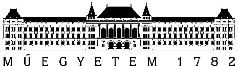

{width="2.1118055555555557in"
height="0.5916666666666667in"}

Budapesti Műszaki és Gazdaságtudományi Egyetem

Villamosmérnöki és Informatikai Kar

Szokoly-Angyal Armand

BuildingSketcher

[Hideg Attila]{.smallcaps}

BUDAPEST, 2025

# Bevezetés

A BuildingSketcher projekt egy olyan, Androidra fejlesztett alkalmazás,
melynek célja épületek formájának vizualizálása pusztán egy papír és
tollvonások felhasználásával. Az alkalmazás kiterjesztett valóságot
használ a cél elérésére, és használatához csupán egy Android telefon
szükséges, mely kompatibilis a Google AR Core-ral, valamint egy legalább
A4 méretű lap és toll.

Az alkalmazás detekálja a papír jelenlétét és helyzetét a térben, és az
arra rajzolt vonalakat extrapolálja falakká, mely alkalmas lehet egy
egyszerűbb épület vázlatának háromdimenziós megjelenítésére.

Az alkalmazás jelenlegi formájában még sajnos nem alkalmas teljes
alaprajz megjelenítésére, azonban további finomítással (melyet a
jövőbeli tervekben részletezek) megvalósítható az is, hogy komplexebb
alaprajzokat interaktívan módosítsunk.

# Technológiai háttér és a mérnöki kihívás

Az alkalmazás Unity 6 (6000.0.43f1) editor használatával, az AR
Foundation (6.2.0-pre.4 - May 06, 2025) és a Google AR Core XR plugin
(6.2.0-pre.3 · May 01, 2025) használatával készült. Azért a legfrisebb
pre verziókat alkalmazom, mert a korábbi verziókban egy olyan kritikus
kompatibilitási probléma merült fel, amely miatt nem lehetett az
XrCpuImage (lásd később) komponenst az AR Camera-ról lekérdezni, ezért
kiemelem, hogy erre külön figyeljen oda az, aki ezt az eszközt
fejleszteni szeretné. Ezen túl a projekt alapbeállításai a hivatalos AR
Foundation dokumentációja\[1\] szerint leírtakat követik.

A lap- valamint a vonaldetektálás a nyílt forráskódú OpenCV C++ könyvtár
segítségével valósult meg. Létezik Unityben egy (2025-ben legalábbis)
fizetős bővítmény is, ez a projekt azonban saját c++ megvalósításra
fókuszál a projekt használati esetének egyedisége okán. Ezt a c++ kódot
majd CMake és Gradle segítségével .so fájlba kell csomagolni, hogy a
Unity tartalmazhassa a natív kódot a buildben, és C#-ban meghívhassuk (a
részletes **ajánlott** developer flow-ról később).

A „mérnöki kihívás" ebben a feladatban 2 fő problémára osztható fel:

- A megfelelő OpenCV logika megvalósítása,

- Majd annak megfelelő hozzákapcsolása a Unity csővezetékéhez, mely
  alatt ezúttal a Unity AR Foundation beépített AR grafikai render
  csővezetékét értem.

Ez utóbbi probléma nem triviális, ugyanis egy olyan **koordináta
konverziós csővezetéket** kell megvalósítanunk ehhez a Unity AR
Foundation beépített koordináta-konverziós csővezetékével párhuzamosan,
mely tökéletesen „másolja" azt. Ennek pontos folyamatáról később írok. A
koordináta konverzió alatt ezúttal pontosan a 2D kamera képének az
Android készülék képernyőjére, majd aszerint a Unity világba való
transzformálását értem. A későbbiekben ennek a folyamatnak a fenti
eszközökbe beépített részét az egyszerűség kedvéért „AR render
csővezetéknek", vagy csak „Unity csővezetéknek" fogom hívni. Azt fontos
előrevetítenem, hogy ez a feladat jelenleg **nincsen teljesen jól
implementálva** ebben a programban, ami torzított AR megjelenítést
eredményez, de az app még így is használható.
